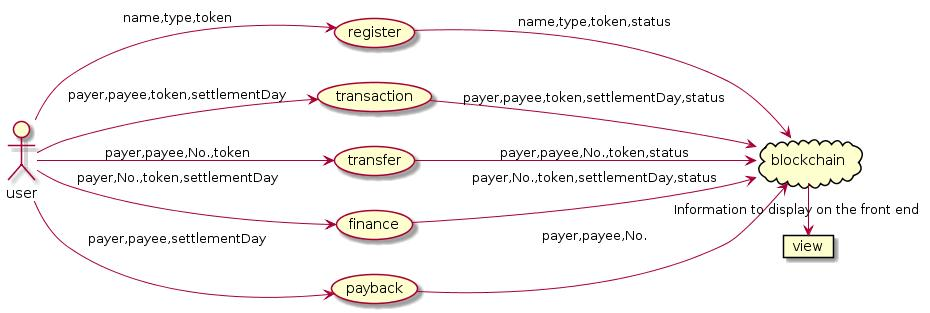
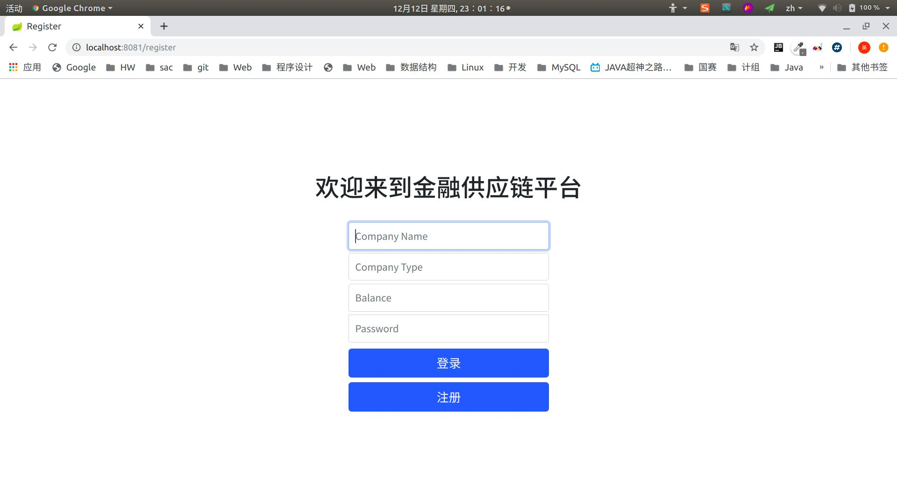
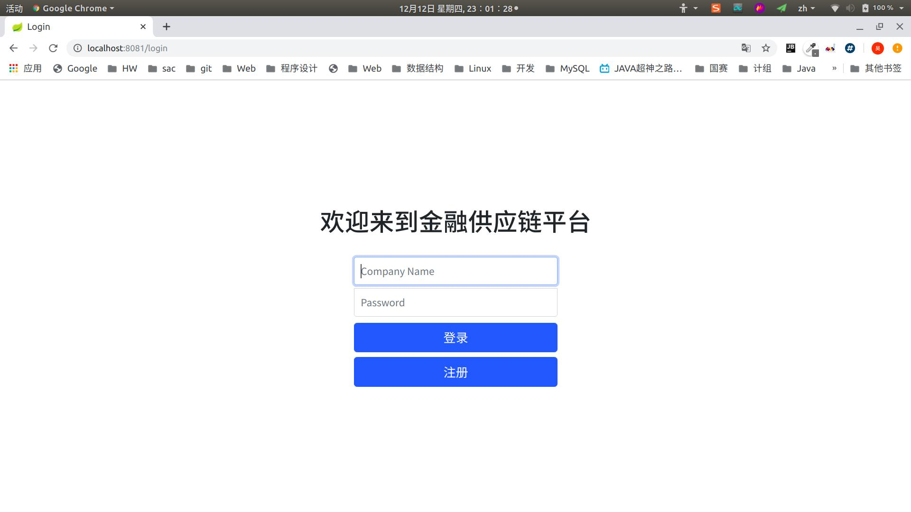
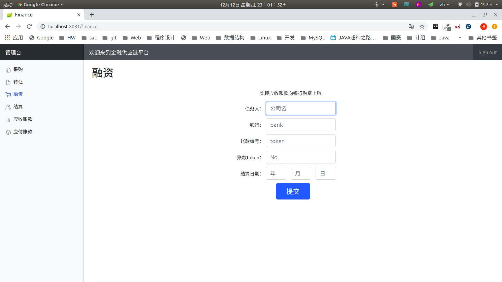

# A Supplychain based on FISCO BCOS

### 1 项目背景

​	在传统供应链金融场景中,存在交易信息不透明、企业信用评级无法在整个供应链
传递的痛点。为了解决这种问题,实现供应链应收账款资产的溯源、流转,人们开始基
于区块链技术的发展,探索“区块链+金融”,将供应链的每一笔交易和应收账款单据上
链,同时引入第三方可信机构确认信息,以保证交易和单据的真实性。同时,支持应收
账款的转让、融资和清算等,让核心企业的信用可以传递到供应链的下游企业,减小中
小企业的融资难度。

​	本项目基于以上背景,以 FISCO BCOS 作为底层开发了一个 Java Web 区块链应
用。

### 2 技术栈

前端:模板引擎 Thymeleaf,前端框架 Bootstrap

合约端:FISCO BCOS,Solidity

后端:Spring Boot

### 3 实现功能

- 注册
- 登录：登陆后通过session的方式让后端识别操作者身份
- 管理台
  - 实现四个基本功能的交互
  - 展示账户主题应收账款和应付账款的欠款方、收款方、账单金额、截止日期、是否已结算
- 登录拦截器：以防用户即使不登录也能通过url的方式访问到管理台界面
- 解决了刷新时表单重复提交的问题
- 在每个界面操作时，成功或失败都会有提示语，整体前端风格简洁易用

### 4 数据流图与存储设计

### 5 界面

#### 注册界面

#### 登录界面

#### 交易界面

#### 展示应收账款和应付账款界面

